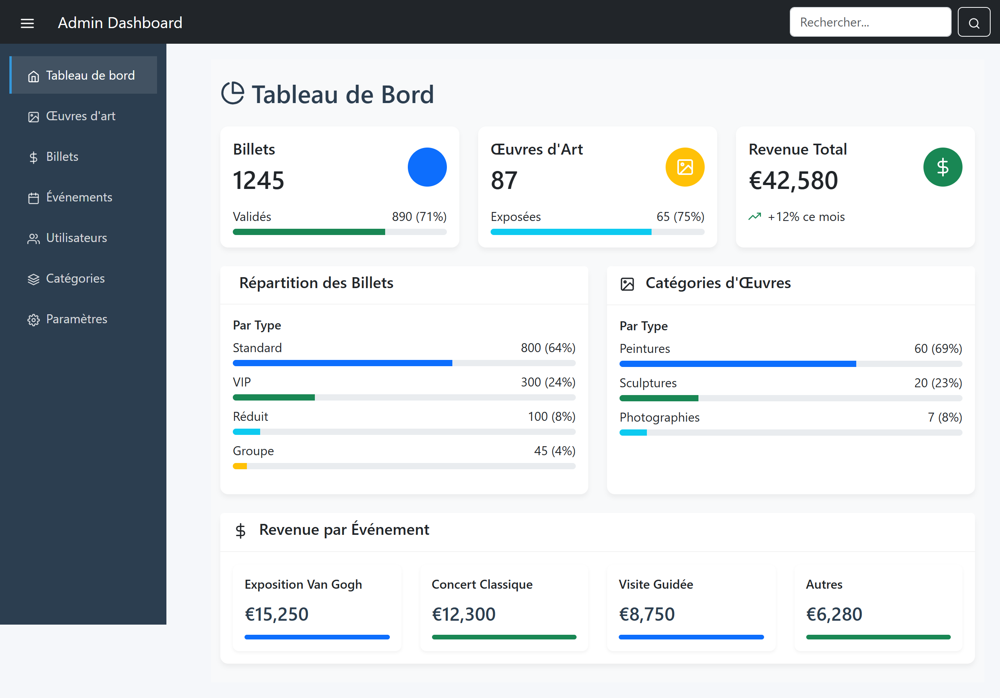
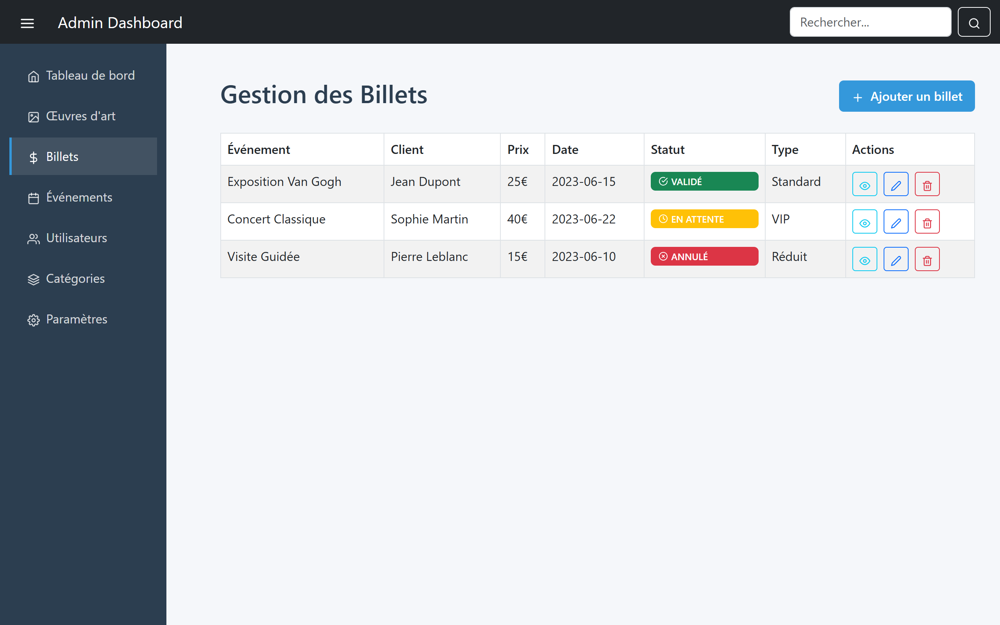
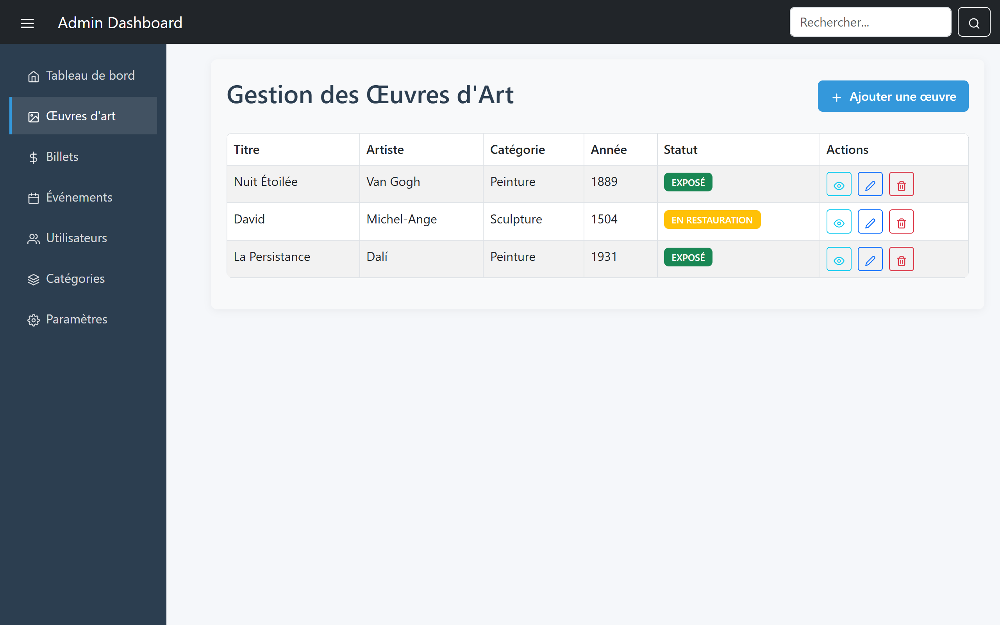

# 🎟️ Eventbrite Clone – Event Management System

Welcome to the **Eventbrite Clone**, an event management platform that allows users to seamlessly create, manage, and attend events! Whether you're an organizer or an attendee, this app delivers a streamlined experience from event creation to real-time updates. 🚀

---

## 🧩 Features

- 📝 **Event Creation**: Organizers can create and customize events with details, images, and schedules.
- 🎫 **Ticket Booking**: Users can book and manage tickets with secure checkout.
- 👥 **User Registration/Login**: Role-based access for organizers and attendees.
- 🔔 **Real-time Updates**: Stay informed with notifications and live event status.
- 📅 **Event Dashboard**: View upcoming events, manage bookings, and track attendance.

---

## 📸 Screenshots

Here’s a preview of the app in action:

### Event Dashboard (Organizer Back Office)
  
**Description**: The back office event dashboard allows attendees to view event details, book tickets, and check event schedules.

 
---

## 🛠️ Ticket & Billet Management

### 🎫 **Ticket Booking (Front Office)**  
  
**Description**: Users can browse available events, select ticket types, and complete secure checkout.

### 🎟️ **Billet (Event Tickets) – Back Office**  
  
**Description**: Organizers can generate and distribute digital tickets (billets) to attendees. Tickets include QR codes for event entry validation.

### 🎫 **Ticket Management – Back Office**  
  
**Description**: Organizers can create different ticket types (e.g., VIP, General Admission), set prices, monitor ticket sales, and issue refunds if needed.

---

## 🚀 Tech Stack

- **Frontend**: React
- **Backend**: Node.js
- **Database**: PostgreSQL
- **Authentication**: JWT

---

## 📦 Installation

```bash 

# Install dependencies
npm install

# Start the development server
npm start
